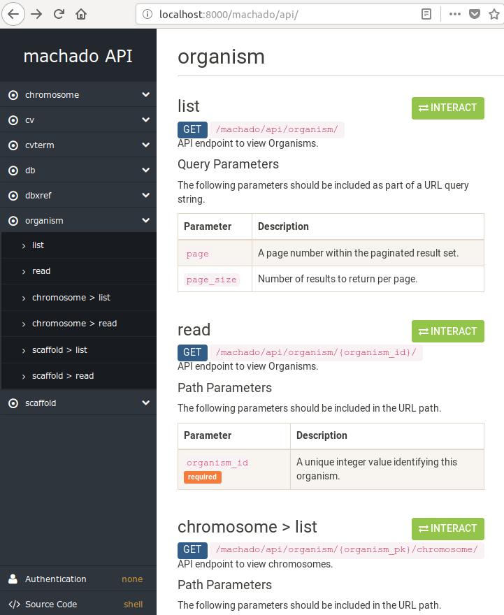

[![build-status-image]][travis]
[![cov-status-image]][codecov]

# machado

machado is a Django app that contains tools to interact with a Chado database.
Detailed documentation can be found in the **docs** directory ([INSTALL](INSTALL.md)).

## Quick start

1. Download the package

        git clone https://github.com/lmb-embrapa/machado.git

2. Install the package

        python setup.py install

3. Add "machado" to your settings.py INSTALLED_APPS like this:

        INSTALLED_APPS = [
            ...
            'machado',
            'rest_framework',
            ...
        ]

4. Configure the settings.py DATABASES to connect to a PostgreSQL database.

## Example

[build-status-image]: https://secure.travis-ci.org/lmb-embrapa/machado.svg?branch=master
[travis]: https://travis-ci.org/lmb-embrapa/machado
[cov-status-image]: https://img.shields.io/codecov/c/github/lmb-embrapa/machado/master.svg
[codecov]: https://codecov.io/gh/lmb-embrapa/machado
